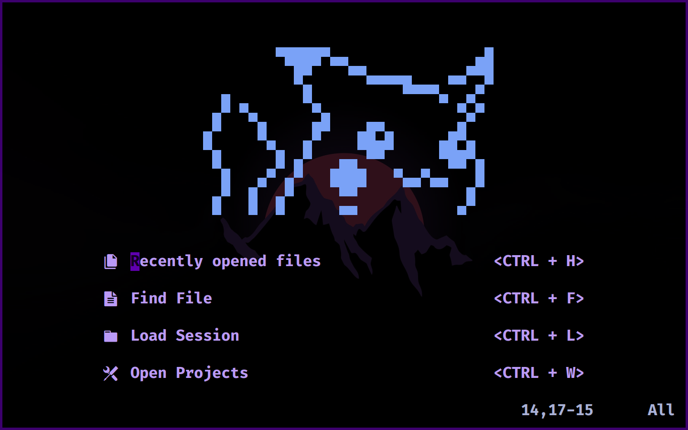

# Vimy
This is my personal neovim setup.



<!-- TABLE OF CONTENTS -->
## Table of Contents

* [Project Structure](#project-structure)
* [Install](#install)
* [License](#license)

## Project Structure
```
vimy/
|-- lua/
|-- lua/
|   |-- vimy/
|       |-- colorscheme.lua
|       |-- dashboard.lua
|       |-- init.lua
|       |-- lualine.lua
|       |-- packer.lua
|       |-- remap.lua
|       |-- set.lua
|       |-- telescope.lua
|       |-- treesitter.lua
|       |-- undotree.lua
|
|-- AUTHORS
|-- demo.png
|-- init.lua
|-- LICENSE
|-- README.md
```

## Install
> Install from github: 
```shell
git clone https://github.com/nemo256/vimy \
  ~/.config/nvim
```

> Install packer: 
```shell
git clone --depth 1 https://github.com/wbthomason/packer.nvim\
  ~/.local/share/nvim/site/pack/packer/start/packer.nvim
```
## License
- Please read [vimy/LICENSE](https://github.com/nemo256/vimy/blob/master/LICENSE)
